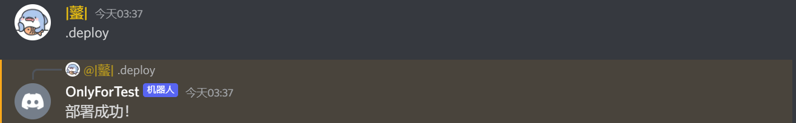

# Discord Music Bot

一个简单的娱乐型discord机器人，通过命令，如播放音乐或删除文本信息，（稍微）帮助你管理你的服务器。

## 内容表

>* [要求](#要求)
>* [开始](#开始使用)
>* [常见错误](#常见错误)
>* [贡献](#贡献)
>* [作者](#作者)
>* [许可证](#许可证)
---
## 要求

>* [Node](https://nodejs.org/en/) - 版本16或更高
>* [NPM](https://www.npmjs.com/)
>* [FFMPEG](https://www.ffmpeg.org/)
---
## 开始使用

首先，确保你在本地机器上安装了所有需要的工具，然后继续执行这些步骤。

### 安装

```bash
# 克隆版本库
git clone https://github.com/StarGolx/DCMusicBot.git

# 进入该目录
cd DCMusicBot/

# 安装依赖项
npm install
```

---

## 需要的权限

>**⚠️ *重要的是*：确保你的机器人启用了`applications.command`应用范围，这可以在[开发者门户](https://discord.com/developers/applications/)上的`OAuth2`选项下找到。**

### 配置

在克隆项目并安装所有的依赖项后，你需要在[config.json](./config.json)文件中添加你的Discord API token

### 启动机器人

```bash
node index.js
```

---

## 部署命令

在你使用bots斜线命令之前，你首先需要将它们添加到你的Discord服务器上。你可以使用`.deploy`命令来做到这一点。



部署命令后，你应该可以通过输入斜线来查看和访问它们。


---

## 功能和命令

* 🎶 通过网址播放YouTube上的音乐：

```
/play <YOUTUBE链接>
```

* 🎶 使用歌曲名称播放音乐：

```
/play <歌名>
```

* ⏸️ 暂停音乐：

```
/pause
```

▶️ 继续播放音乐：

```
/resume
```

* ⏭️ 跳过歌曲：

```
/skip
```

* ⏹️ 停止播放：

```
/stop
```

* 🔃 打乱列表：

```
/shuffle
```

* 移动歌曲位置：

```
/move <歌曲编号> <目标位置>
```

* 🔄️ 交换歌曲位置：

```
/swap <歌曲1> <歌曲2>
```

* 🗑️ 移除歌曲：

```
/remove <歌曲编号>
```

当前播放的歌曲只需要用`/skip`命令就行了

* ⏯️ 正在播放：

```
/nowplaying
```

* 获取一个用户的信息：

```
/userinfo <用户>
```

* 封锁一个玩家：

```
/ban <用户>
```

* 删除最新的聊天信息：

```
/purge <信息数量>
```


## 常见错误

下面是一个常见错误的列表，以及你如何解决这些问题。

### 依赖不是最新的

此存储库中使用的包经常更新，尤其是 ytdl-core 包。这就是为什么如果您收到诸如"无效 URL：未定义"之类的错误或当机器人在运行播放命令时崩溃时，总是值得尝试更新这些内容的原因。

```bash
npm install ytdl-core@latest
```

### FFMPEG 未安装在运行机器人的机器上

`/play` 命令要求在运行机器人的机器上安装 FFMPEG。 可以在官方[FFMPEG 网站](https://www.ffmpeg.org/)上下载。

## FAQ常见问题

* ### 如何查看歌曲编号？

只需要输入这窜命令就行了：

```
/queue
```

下一首歌曲对应的是编号1，以此类推

## 贡献

欢迎您通过向存储库提交拉取请求来做出贡献。

## 作者

StarGolx & ZerOne

## 许可证

这个项目是在 MIT 许可下获得许可的。有关详细信息，请参阅 [LICENSE](LICENSE) 文件
